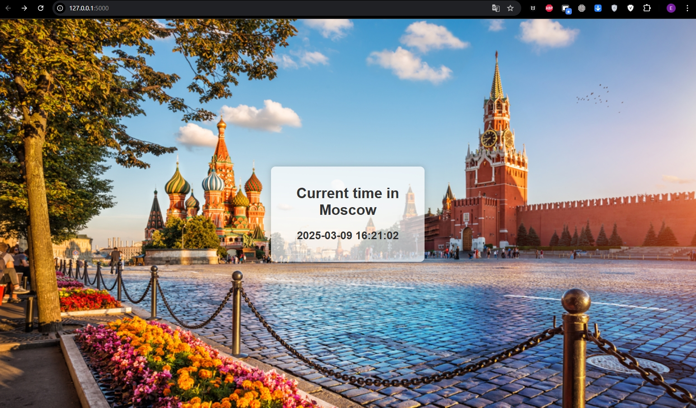
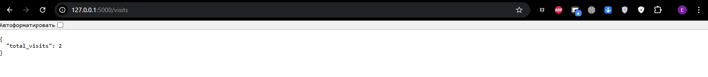

# Python web application: Moscow Time

## Overview

This web application displays the current time in Moscow, Russia. Also, tracks and displays visit counts.

## Prerequisites

Before running the application, ensure you have the following installed:

- Python 3.8 or higher
- pip (Python package manager)
- Flask 3.1.0
- pytz 2024.2
- pytest 8.3.0
- Jinja2 3.1.5

## Installation

**1. Clone the repository:**
```bash
git clone https://github.com/zDragonLORD1010/S25-core-course-labs.git
```

**2. Navigate to the project folder:**
```bash
cd /your_path/S25-core-course-labs/app_python
```

**3. Install dependencies:**
```bash
pip install -r requirements.txt
```

**4. Running the application**
- Start the Flask development server:
```bash
python run.py
```
- Open your browser:
Navigate to **http://127.0.0.1:5000/** to view the application.
- Check the output:
You should see the current time in Moscow displayed on the page.

## Docker

1. **Steps to build, push, and run Docker:**

- **Build the Docker Image:**
```bash
docker build -t moscow-time-app:1.0 .
```

- **Run Docker locally:**
```bash
docker run -p 5000:5000 moscow-time-app:1.0
```

2. **Push to Docker Hub (put your dockerhub username instead of your_username):**

- **Tag the image:**
```bash
docker tag moscow-time-app:1.0 your_username/moscow-time-app:1.
```

- **Push the image:**
```bash
docker push your_username/moscow-time-app:1.0
```

3. **Pull and run Docker:**
```bash
docker pull your_username/moscow-time-app:1.0
docker run -p 5000:5000 your_username/moscow-time-app:1.0
```

## Unit tests

This project includes unit tests to ensure correct functionality.

### Implemented Tests:

- **Homepage Test (test_homepage):** Ensures the homepage loads successfully and contains the correct content.
- **Time Validation Test (test_moscow_time):** Verifies that the displayed Moscow time matches the actual time.

### Running Tests:

To run all unit tests, execute:
```bash
pytest
```

## Continuous Integration (CI) best practices

### 1. Workflow enhancements 

[](https://github.com/zDragonLORD1010/S25-core-course-labs/actions/workflows/app_python_ci.yml)

- Added **GitHub Actions status badge** to monitor workflow status.

- Implemented **caching for dependencies** to speed up builds.

### 2. Security best practices
- Integrated **Snyk Vulnerability Scanning** to detect security issues in dependencies.

### 3. Optimization steps
- Improved workflow efficiency by reducing redundant steps.
- Used best practices in job dependencies to prevent unnecessary re-runs.

## API Screenshots

### Main page



### Visits endpoint

- The number of visits allowed for the file (`data/visits.txt`) is saved after restarting the container.
- `http://127.0.0.1:5000/visits`: Returns total visit count



